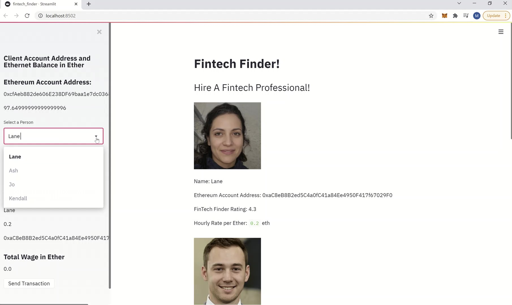
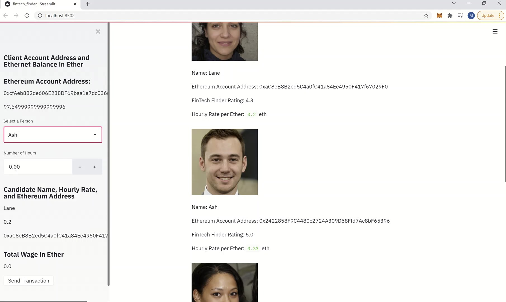
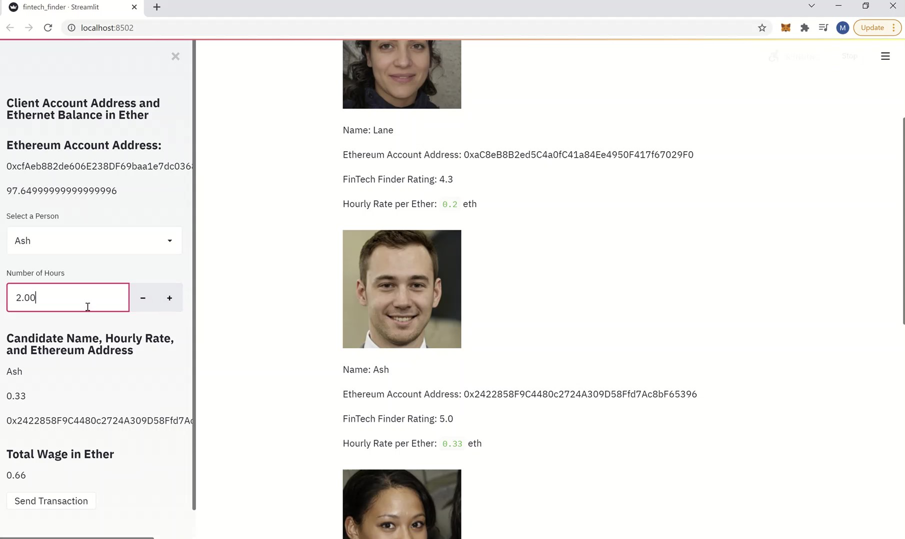

# module-19-asgmt
Fintech Finder Application 

As shown in theses images below we can see the Fintech professionals list with
their name, ether address, rating and their hourly rate.
And also on the left side of the app we can see a side bar holds the client information 
and options to fill up and excute the transaction button.

The following image shows how the client use the side bar; how select a person from the 
drop down box and input the hours for how long is going to hire.

In this example the client chose Ash because of his highst rating point and hired him for 2 hours.

After we confirm the candidate name, total wage and the candidate's ether address we can send the transaction
by cliking on 'send transaction' button. As we can see in the image below the client sent the transaction and
the validated transaction hash is shown.

